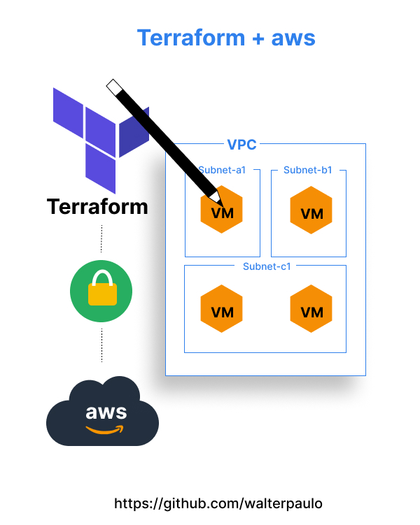
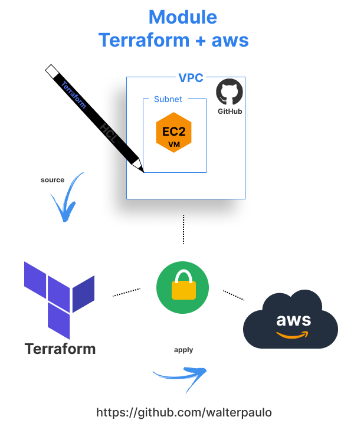
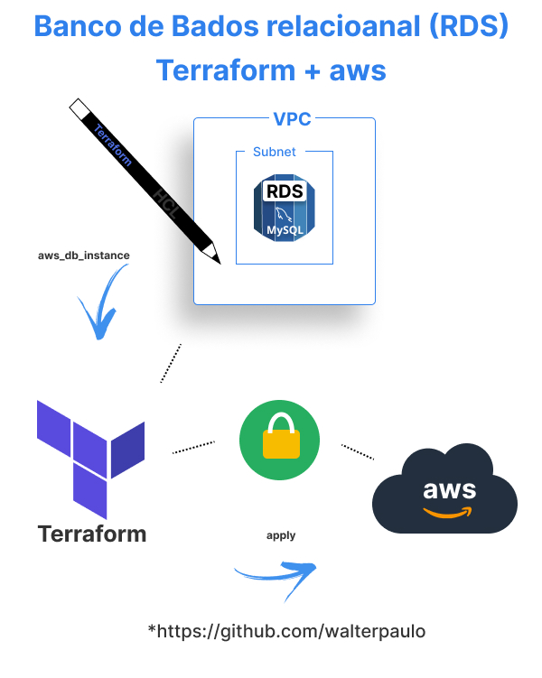
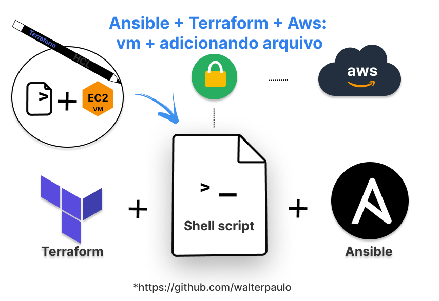

# Treinamento: Desafio de 21 dias em DevOps

Acredito que Devops define em: Mudanças, autamatizar processos manuais, mensurar resultados e compartilhar conhecimento.

### Menu 

1. [SHELL SCRIPT](./base/shellscript/shellscript.md)
2. [TERRAFORM](./base/terraform/terraform.md)
3. [ANSIBLE](./base/terraform/terraform-ansible.md)
3. [REFERÊNCIAS](./base/credit/credit.md)
5. [ANEXO A - TERRAFORM](./base/terraform/install/anexo_A_terraform_install.md)
6. [ANEXO B - AWS](./base/terraform/install/anexo_B_aws_install.md)

### Exemplo

<!--  -->

### Importânte
* Diretório Shell script, [abrir?](base/shellscript/example/);

* Diretório TerraForm, [abrir?](base/terraform/example/).